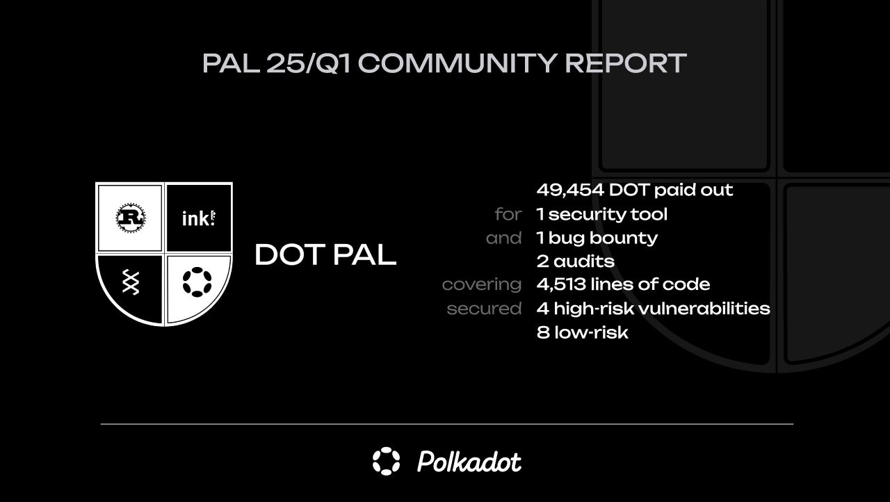

# PAL Community Report 2025 / Q1
Date: 22.05.2025

This Community report summarizes the activity of the Polkadot Assurance Legion (PAL) during the period January-March 2025.

## PAL

The Polkadot Assurance Legion (PAL) is a community-driven initiative that aims to make Polkadot a safer and more attractive place for both builders and users by allocating funds from the Polkadot Treasury ([bounty #22](https://polkadot.subscan.io/bounty/22)) to advance security in Rust / Polkadot SDK.

PAL provides funding for audits (Rust and Solidity), security tooling, bug bounties, and common-good security initiatives. Find out more about the various funding opportunities on [PAL’s homepage](https://dotpal.io).

## Summary

In the period January-March 2025, PAL has provided funding for 2 parachain audits, 1 security tool, and 1 bug bounty.

The conducted audits helped secure **4,513** lines of code (LOC) and identify a total of **12** vulnerabilities, **4** of which classified as high-risk.

In the [security tooling bucket](/funding/security_tooling), PAL provided funding for the completion of [Scout](https://github.com/CoinFabrik/scout-audit/) - a static analysis tool which enables developers to automatically identify common vulnerabilities in their Substrate runtimes (e.g. unsafe math). You can find more about Scout on our [security tooling](/security_tooling#scout-by-coinfabrik) page.

Furthermore, PAL started a consultation round to collect feedback on its first Request for Proposals (RFP) for the development of an [ecosystem monitoring tool](https://forum.polkadot.network/t/specs-for-an-ecosystem-monitoring-tool-funded-by-pal/12160), denominated [RFP2501](/rfp/2501).

Finally, PAL co-funded for the first time a payout under a [bug bounty program](/funding/bug_bounty).

Spending breakdown:

| What             | How much       |
|------------------|----------------|
| Audits           | 19,663 DOT     |
| Tooling          | 16,517 DOT     |
| Bug bounties     | 3,304 DOT      |
| Curator salaries | 9,970 DOT      |
|                  |                |
| **Total**        | **49,454 DOT** |

## Overview
### Audits
| ID   | Audit             | Co-funded  | LOC    | Critical  | High | Med | Low  | Report                                               |
|------|-------------------|------------|--------|-----------|------|-----|------|------------------------------------------------------|
| 3363 | kilt-oak-2502     | 6,271 DOT  | 2, 127 | 0         | 1    | 0   | 5    | [Report](/audit_reports/25q1/kilt-oak-2502.pdf)      |                             |
| 3636 | hydration-oak-2503 | 13,392 DOT | 4,513  | 0         | 3    | 0   | 3    | [Report](/audit_reports/25q1/hydration-oak-2503.pdf) |

### Tooling
| ID   | Audit                               | Paid out  | Category        | Github                                           | Docs                                                                                                        |
|------|-------------------------------------|-----------|-----------------|--------------------------------------------------|-------------------------------------------------------------------------------------------------------------|
| 3058 | Coinfabrik Scout 50% of MS2 and MS3 | 5,205 DOT | Static Analysis | [Github](https://github.com/CoinFabrik/scout-audit/) | [offer](/tooling/24-coinfabrik-scout-offer.pdf), [milestones](/tooling/24-coinfabric-scout-milestones.xlsx) |
| 3379 | Coinfabrik Scout 50% of MS3 and MS4 | 7,066 DOT | Static Analysis | [Github](https://github.com/CoinFabrik/scout-audit/) | [offer](/tooling/24-coinfabrik-scout-offer.pdf), [milestones](/tooling/24-coinfabric-scout-milestones.xlsx) |
| 3654 | Coinfabrik Scout 50% of MS4         | 4,246 DOT | Static Analysis | [Github](https://github.com/CoinFabrik/scout-audit/) | [offer](/tooling/24-coinfabrik-scout-offer.pdf), [milestones](/tooling/24-coinfabric-scout-milestones.xlsx) |

### Bug bounties
| ID   | Bug bounty              | Co-funded  |
|------|-------------------------|------------|
| 3624 | acala-immunefi-bb-2503  | 3,304 DOT  |

### Other
The PAL curators have received in total 9,970 DOT as remuneration for their work. This corresponds to $3,000 per curator per month, using the 30d EMA DOT price.
