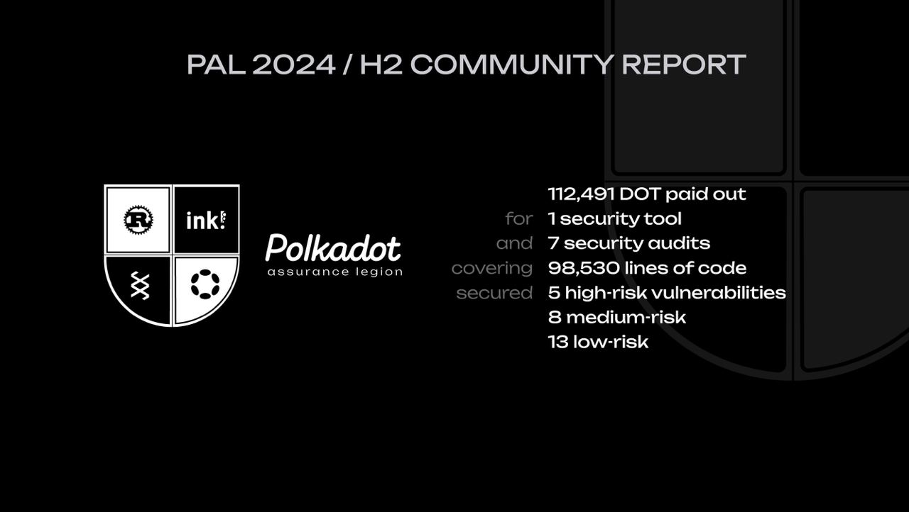

# PAL Community Report 2024 / H2
Date: 22.02.2025

This Community report summarizes the activity of the Polkadot Assurance Legion (PAL) during the period July-December 2024. From 2025 onward, PAL will be publishing community reports on a quarterly basis.

## PAL

PAL is a community-driven initiative that aims to make Polkadot a safer and more attractive place for both builders and users by allocating funds from the Polkadot treasury (bounty #22) to advance security in Rust / Polkadot SDK.

In 2024 H2, PAL saw an enlargement in the scope of its activities. Initially, PAL was only providing funding for Rust audits of Polkadot projects (parachains and smart contracts). As a result of [OpenGov Ref. #1074](https://polkadot.polkassembly.io/referenda/1074), the mandate of PAL was extended to also include audits of common-good functionality. What comes to mind are pallets that are used by System Chains, or pallets that are of importance to multiple Polkadot projects. Funding for Solidity audits is now also available.

Beyond audits, PAL now can also provide incentives for the development of common-good tooling which benefits security in the Polkadot ecosystem. Furthermore, PAL can also provide support for other common-good security initiatives. Find out more about the various funding opportunities on [PAL’s homepage](https://dotpal.io).

## Summary

In the period July-December 2024, PAL has provided funding for 7 parachain audits, and 1 security tool.

The conducted audits helped secure 98,530 lines of code (LOC) and identify a total of 26 issues, 5 of which classified as High Impact. 2 of the audits are continuous, meaning that they are carried on all the code pushed by a team during several weeks / months.

PAL also started providing funding for its first security tool - [Coinfabrik Scout](https://github.com/CoinFabrik/scout-audit/), a static analysis tool which enables developers to identify common vulnerabilities in their code (e.g. unsafe math). This project also includes a machine learning dataset which can be used to RAG train a model on Polkadot-SDK vulnerabilities -- [scout-substrate-dataset](https://github.com/CoinFabrik/scout-substrate-dataset). This dataset is also available on [Hugging Face](https://huggingface.co/datasets/CoinFabrik/scout-substrate). In 2024 H2, PAL funded the successful delivery of the first 2 milestones of the project.

Spending breakdown:

| What             | How much        |
|------------------|-----------------|
| Audits           | 84,262 DOT      |
| Tooling          | 10,695 DOT      |
| Curator salaries | 17,534 DOT      |
|                  |                 |
| **Total**        | **112,491 DOT** |

## Overview
### Audits
| ID   | Audit                 | Co-funded  | LOC          | Critical | High | Med | Low | Report                                                  |
|------|-----------------------|------------|--------------|----------|------|-----|-----|---------------------------------------------------------|
| 1691 | laos-coinfabrik-2407  | 8,434 DOT  | 18,190       | 0        | 1    | 1   | 2   | [report](/audit_reports/24h2/laos-coinfabrik-2407.pdf)  |
| 2423 | frequency-srl-2409    | 18,000 DOT | 9,379        | 0        | 0    | 0   | 2   | [report](/audit_reports/24h2/frequency-srl-2409.pdf)    |
| 2424 | peaq-srl-2409*        | 18,000 DOT | (continuous) | 0        | 4    | 4   | 5   | [report](/audit_reports/24h2/peaq-srl-2409.pdf)         |
| 2427 | hydration-pashov-2410 | 6,511 DOT  | 975          | 0        | 1    | 3   | 5   | [report](/audit_reports/24h2/hydration-pashov-2410.pdf) |
| 2661 | zeitgeist-oak-2410    | 14,814 DOT | 6,273        | 0        | 3    | 4   | 4   | [report](/audit_reports/24h2/zeitgeist-oak-2410.pdf)    |
| 2662 | astar-srl-2411        | 2,023 DOT  | 125          | 0        | 0    | 0   | 0   | [report](/audit_reports/24h2/astar-srl-2411.pdf)        |
| 2838 | moonbeam-srlabs-2411 | 2,023 DOT  | (continuous) | 0        | 0    | 0   | 1   | [report](/audit_reports/24h2/moonbeam-srl-2411.pdf)     |
  
  
The reports for audits marked with `*` are still not available, once ready they will be included in this report.

### Tooling
| ID   | Audit                               | Paid out  | Category        | Github                                               | Docs                                                                                                        |
|------|-------------------------------------|-----------|-----------------|------------------------------------------------------|-------------------------------------------------------------------------------------------------------------|
| 2460 | Coinfabrik Scout 50% of MS1         | 4,425 DOT | Static Analysis | [Github](https://github.com/CoinFabrik/scout-audit/) | [offer](/tooling/24-coinfabrik-scout-offer.pdf), [milestones](/tooling/24-coinfabric-scout-milestones.xlsx) |
| 2700 | Coinfabrik Scout 50% of MS1 and MS2 | 6,270 DOT | Static Analysis | [Github](https://github.com/CoinFabrik/scout-audit/) | [offer](/tooling/24-coinfabrik-scout-offer.pdf), [milestones](/tooling/24-coinfabric-scout-milestones.xlsx) |

### Other
The PAL curators have received in total 17,534 DOT as remuneration for their work. This corresponds to $3,000 per curator per month, using the 30d EMA DOT price.
